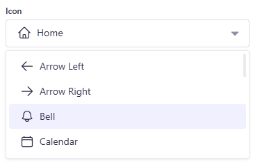

# Strapi Plugin — Icon Picker (v5)

A zero-config **custom field** for Strapi v5 that lets editors pick an icon from files you drop in the plugin’s `admin/src/icons/` folder.
Works with **React SVG components** (`.tsx/.jsx`) and **raw `.svg` files**, auto-discovers them, renders a visual picker (dropdown or grid), and stores the **icon name** (filename, unchanged) in your content.

> **Tip:** For best readability, set `stroke="currentColor"` and/or `fill="currentColor"` in your SVG React components. Icons inherit surrounding text colour **only if your SVG uses `currentColor`** (or forwards `...props` so you can pass `color`). Otherwise, the SVG’s hard-coded colour is used.

> **Note on bundled icons:** This plugin includes a small, curated subset of **Heroicons** as starter icons (MIT-licensed). You can add more anytime—see “Using Heroicons React components” below.

---

## Table of contents

* Features
* Quick look (screenshots)
* Install
* Usage
* API output (what’s stored/returned)
* Adding icons
* Using Heroicons React components
* Options
* Styling & size
* Accessibility
* Permissions & roles sanity check
* Development
* Roadmap
* License

---

## Features

* 🔎 **Auto-discovery** of icons in `admin/src/icons/` (React components or `.svg` files)
* 🏷️ **Readable labels** derived from filenames (`BookableSpace` → “Bookable Space”)
* 🧩 **Manual overrides** supported (same slug wins)
* 🎛️ **Whitelist** per field via schema `options.iconList`
* 🧼 **CSS-only sizing**: icons are clamped to **20×20** to avoid overflow
* 🧑‍🦽 A11y: icons are `aria-hidden` within the select; labels remain visible
* 🧰 **Views**: dropdown or **tile grid** (`options.grid: true`)
* 🔍 Optional **search** box (`options.search: true`)

---

## Quick look (screenshots)

> These images live in `/docs` in the repo and are excluded from the npm package.

* **Dropdown view:**

  

* **Grid view:**

  

---

## Install

From npm:

```bash
npm i @vadim-libraryon/strapi-plugin-icon-picker
# or
yarn add @vadim-libraryon/strapi-plugin-icon-picker
```

Enable in `config/plugins.ts`:

```ts
export default () => ({
  'icon-picker': { enabled: true },
});
```

Rebuild admin:

```bash
npm run build && npm run develop
```

**Local development** (as a local plugin):

```ts
// config/plugins.ts
export default () => ({
  'icon-picker': {
    enabled: true,
    resolve: './src/plugins/icon-picker',
  },
});
```

---

## Usage

Add a field to your content-type schema:

```json
{
  "attributes": {
    "icon": {
      "type": "customField",
      "customField": "plugin::icon-picker.icon",
      "options": {
        "iconList": ["ArrowRight", "Envelope"],
        "grid": false,
        "search": true
      }
    }
  }
}
```

The stored value is the exact **filename** (without extension), e.g. `"ArrowRight"`.
The UI shows a prettified label (e.g. “Bookable Space”).

---

## API output (what the client sees)

The field stores and returns a **string** (the icon’s name):

```json
{ "icon": "Home" }
```

Useful if you have matching icon names on the frontend—you can render the same icon dynamically.

---

## Adding icons

Place files in the plugin at:

```
src/plugins/icon-picker/admin/src/icons/
```

### 1) React component (default export)

```tsx
// src/plugins/icon-picker/admin/src/icons/BookableSpace.tsx
const BookableSpace = (props: React.SVGProps<SVGSVGElement>) => (
  <svg viewBox="0 0 24 24" fill="none" stroke="currentColor" {...props}>
    {/* paths */}
  </svg>
);
export default BookableSpace;
```

**Best practice:** use `stroke="currentColor"` and/or `fill="currentColor"` (and optionally forward `...props`).

### 2) Raw SVG

```
src/plugins/icon-picker/admin/src/icons/family-history.svg
```

The plugin wraps it and clamps size via CSS; no extra code needed.

### 3) Optional human label via sidecar meta

```json
// src/plugins/icon-picker/admin/src/icons/MyIcon.meta.json
{ "label": "My Fancy Icon" }
```

If both a React component and a `.svg` exist for the same basename, the component wins.

---

## Using Heroicons React components

A small subset ships with the plugin (MIT). To add more:

1. Install `@heroicons/react` in your app.
2. Copy only the icon components you need into `admin/src/icons/` (or re-export with your own wrappers).
3. Ensure they use `currentColor` if you want CSS-driven colour.

---

## Options

Per-field in schema:

```json
"options": {
  "grid": true,
  "search": true,
  "iconList": ["Home", "Search", "Bell"]
}
```

* `grid` (boolean, default **false**) — render icons as a **tile grid** instead of a dropdown.
* `search` (boolean, default **false**) — show a search box to filter icons (works in both modes, but more useful in grid mode if you have a lot of icons).
* `iconList` (string[], optional) — whitelist to show a curated subset.

---

## Styling & size

Icons render inside a fixed 20×20 box:

```css
.iconBox { width: 20px; height: 20px; display: inline-flex; align-items: center; justify-content: center; overflow: hidden; line-height: 0; }
.iconBox svg { width: 100%; height: 100%; max-width: 100%; max-height: 100%; }
```

To recolour via CSS, change the text colour of the surrounding element (requires `currentColor` in your SVG).

---

## Accessibility

Icons are `aria-hidden` within the select; visible textual labels are used for clarity.
Use meaningful filenames since they become the stored values.

---

## Permissions & roles sanity check

To verify this field behaves with restricted users:

1. **Admin role with minimal rights**

   * Go to **Settings → Administration Panel → Roles**.
   * Create a role with **Content Manager** access only to a content type that includes the icon field (Create/Read/Update).
   * Create a test admin user with this role and confirm the **Icon Picker renders** and saves.

2. **End-user API roles** (Users & Permissions plugin)

   * **Settings → Users & Permissions → Roles**.
   * For `Public`/`Authenticated`, enable read on your content type.
   * Hit the REST endpoint and confirm the field is returned as a **string** (see example above).

If the field doesn’t render for restricted admin roles, double-check that the role can **edit** the content type in Content Manager (custom fields don’t need separate toggles).

---

## Development

```bash
# inside the plugin folder
npm run watch   # hot-rebuild the admin plugin while developing
```

---

## Roadmap

* Optional remote/CDN icon sources
* Size presets & theming

---

## License

MIT
